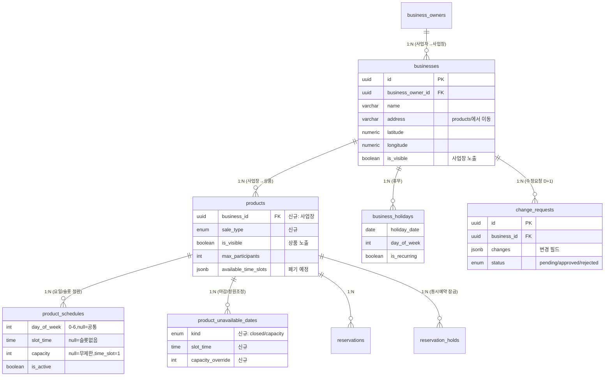

# 설계안 — 사업장 구조 개편 + 상품 판매방식 (통합 데이터 모델)

> 대상: 견적서 과제 2(사업자→사업장→상품 구조) + 과제 5(판매방식 다양화) + 연결 항목(요일별 정원, 휴무/마감 구분, 시간대 마감)
> **두 개편은 커플링** — 주소·휴무·노출이 어느 계층에 사느냐가 판매방식(마감/정원=상품 레벨)과 맞물려서 함께 설계함.
> 상태: **설계 제안 (합의 후 마이그레이션 착수)**. 코딩 전 [결정 필요](#7-결정-필요-합의-포인트) 확정.

---

## 1. 현황 (운영 DB 기준)

- **계층**: 현재 `사업자(business_owners) → 상품(products)` 2단계. **사업장 개념 없음** — 사업자=사업장.
  - 사업자 23 / 상품 22 → **사실상 1:1**. 대부분 사업자당 상품 1개 + 상품 주소 = 사업자 주소 **일치**.
  - 주소·위경도·지역(`address/latitude/longitude/region`)이 **`products`에 직접** 박혀 있음(사업장 정보가 상품에 종속).
- **판매방식 구분 없음** — 모든 상품이 사실상 한 방식. 정원/재고 개념 없음(`max_participants` 단일값만).
- **마감은 수동** — `product_unavailable_dates`에 "단체 예약 마감" 일일이 입력(52건). 휴무/마감 구분 없음.
- **시간대는 jsonb로 이미 존재** — `products.available_time_slots`: `[{day:1~7, start, end, mode, customSlots:[...]}]`. 22개 전부 사용.

→ 핵심: ① 사업장을 독립 계층으로 분리하고 ② 수동 마감을 자동 정원관리로 바꾼다.

---

## 2. 새 계층 구조 — 사업자 > 사업장 > 상품

야놀자 구조와 동일하게 매핑됨:

| 담다 | 야놀자 비유 | 성격 | 보는 화면 |
|---|---|---|---|
| **사업자** (business_owners) | 사업 법인 | 법적 주체·정산·수수료 | (어드민/사장님 내부) |
| **사업장** (businesses, 신규) | **숙소(호텔/펜션)** | 장소·위치·편의시설·소개 | **사업장 상세** ← *지금의 "상품상세"가 여기로* |
| **상품** (products) | **객실/패키지** | 예약 단위·가격·정원·판매방식 | 사업장 상세 안에서 **선택** |

> "현재 상품상세 = 사업장 상세가 되는 느낌" = 맞음. 지금의 상품상세(주소/소개/지도)는 **사업장 상세**가 되고, 실제 예약 대상 "상품"은 그 안에서 고른다.

### 무엇이 어느 계층으로 가나

| 정보 | 현재 위치 | 개편 후 |
|---|---|---|
| 주소·위경도·지역 | products | **사업장** (운영 장소) |
| 편의시설/서비스 | (없음) | **사업장** (신규) — 견적 B-4 |
| 노출/비노출 | products.is_visible | **사업장**(전체) + 상품(개별) **둘 다** |
| 휴무일 지정 | (수동 마감으로 대체) | **사업장** (장소 전체 쉬는 날) |
| 정보 수정 D+1 승인 | (없음) | **사업장** (수정 요청 대상) |
| 가격·정원·판매방식 | products | **상품** (유지·강화) |
| 날짜 마감 | product_unavailable_dates | **상품** (유지) |
| 정산·수수료·세금계산서 | business_owners | **사업자** (유지) |

---

## 3. 판매방식 핵심 통찰 — "정원 − 예약" 하나로 통합

판매방식 3종은 별개 기능이 아니라 **정원을 무엇 단위로 세느냐**의 차이:

| 판매방식 | 정원 단위 | 슬롯 | 예약 차감 |
|---|---|---|---|
| **1. 당일 1건** | 하루 1건 | 없음 | 예약 1건 = 마감 |
| **2. 시간대별** | **슬롯당 1팀(고정)** | 요일별 | 슬롯별 건수 |
| **3. 개수별** | 하루 N개 | 없음 | **인원수만큼** 차감 |

→ **`가용 = 정원(capacity) − 예약(reserved)`** 단일 공식. 별도 테이블 없이 `sale_type`(enum)로 분기.
*(확정된 선택: 시간대 슬롯은 항상 1팀 / 개수별은 인원수 차감 / 시간대는 jsonb 정규화)*

---

## 4. 제안 데이터 모델

### 4.1 `businesses` (사업장, 신규) ★

| 컬럼 | 타입 | 설명 |
|---|---|---|
| `id` | uuid PK | |
| `business_owner_id` | uuid FK | 소속 사업자 |
| `name` | varchar | 사업장명 |
| `address` / `address_detail` / `zipcode` | varchar | products에서 **이동** |
| `latitude` / `longitude` / `region` | | products에서 **이동** |
| `thumbnail` / 대표이미지 | text | 사업장 대표 |
| `intro` | text | 사업장 소개 |
| `contact_phone` | varchar | 사업장 연락처 |
| `is_visible` | boolean | **사업장 단위 노출/비노출** |

> 사업장 정보 수정 D+1 승인은 별도 `change_requests` 테이블로 처리 → 4.2.
> 편의시설/서비스는 **보류**(코어 제외) → 4.2 하단.

### 4.2 `change_requests` (사업장 수정 요청, 신규)

사장님이 사업장 정보를 수정하면 즉시 반영이 아니라 **요청 → 어드민 D+1 승인**. 변경 이력으로 남김.

| 컬럼 | 타입 | 설명 |
|---|---|---|
| `id` | uuid PK | |
| `business_id` | uuid FK | 대상 사업장 |
| `requested_by` | uuid | 요청 사장님 |
| `changes` | jsonb | 변경 필드/값 (before→after) |
| `status` | enum(`pending`/`approved`/`rejected`) | |
| `reviewed_by` | uuid FK(admins) | 처리 관리자 |
| `reviewed_at` / `created_at` | timestamptz | |
| `reject_reason` | text, nullable | |

- 승인 시 `changes`를 `businesses`에 반영. 어드민에 **승인 큐** 화면 연결.
- (확장 여지) 같은 패턴을 상품 수정 승인에도 재사용 가능.

> **편의시설/서비스 — 보류**: 원자료엔 "상품등록 시 사업장 편의시설/서비스 설정·노출(첨부-4)"로 있으나 우선순위 불확실 → **코어 제외**. 추후 `businesses.amenities(jsonb)` 또는 `amenities` 마스터+매핑으로 *덧붙이면 됨*(구조 영향 없음).

### 4.3 `business_holidays` (사업장 휴무, 신규)

| 컬럼 | 타입 | 설명 |
|---|---|---|
| `business_id` | uuid FK | |
| `holiday_date` | date, nullable | 특정일 휴무 |
| `day_of_week` | int, nullable | 요일 반복 휴무(예: 매주 월) |
| `is_recurring` | boolean | |

→ 사업장이 쉬면 그 사업장의 **모든 상품**이 그날 예약 불가. 상품상세엔 **"휴무"**로 표시.

### 4.4 `products` — 변경

| 변경 | 컬럼 | 설명 |
|---|---|---|
| **추가** | `business_id` uuid FK | 소속 사업장 (신규 핵심) |
| 유지 | `business_owner_id` | 정산 조인용 denormalize (유지) |
| **추가** | `sale_type` enum(`daily_one`/`time_slot`/`quantity`) | 판매방식. 기존 22개 → `time_slot` |
| 유지 | `is_visible` | 상품 개별 노출 |
| 유지 | `max_participants` | 1회 예약 최대 인원(그룹 상한) |
| **제거** | `address`/`latitude`/`longitude`/`region` | → 사업장으로 이동 |
| **폐기예정** | `available_time_slots` jsonb | → 4.5로 정규화 후 제거 |

> ~~`block_next_on_full`~~ **불필요 — 제거**. 슬롯 1팀 고정이라 회차는 예약 즉시 자동 마감(동화열차=하루 3회차 각 1팀), 장소 전체 1팀 전세는 **판매방식 1(당일 1건)**이 커버. 두 방식이 양쪽을 이미 처리.

### 4.5 `product_schedules` (신규) — 요일별 정원/슬롯

`available_time_slots` jsonb 정규화. **요일별 예약 가능 인원**도 여기서 해결.

| 컬럼 | 타입 | 설명 |
|---|---|---|
| `product_id` | uuid FK | |
| `day_of_week` | int 0~6 | 요일. `null`=모든 요일 공통 |
| `slot_time` | time, nullable | 시간대. `time_slot`만 사용 |
| `capacity` | int, nullable | 정원. `null`=무제한. time_slot은 항상 **1** |
| `is_active` | boolean | 운영 여부 |

- 방식1(당일1건): slot_time=null, capacity=1
- 방식2(시간대): 요일×슬롯마다 1행, capacity=1
- 방식3(개수별): slot_time=null, capacity=하루 수량(요일별 차등 가능)

### 4.6 `product_unavailable_dates` (기존 확장) — 상품 마감

테이블·기존 컬럼 유지, 컬럼만 추가:

| 추가 컬럼 | 타입 | 설명 |
|---|---|---|
| `kind` | enum(`closed`=마감 / `capacity`=정원조정) | **마감 시각화** 근거 (휴무는 사업장 레벨) |
| `slot_time` | time, nullable | 특정 슬롯만 마감 |
| `capacity_override` | int, nullable | 그날만 정원 다르게 |

> 기존 52건 → `kind='closed'` 백필.

### 4.7 가용성 계산 (앱/뷰 레벨, 추가 테이블 없음)

상품이 특정 `(날짜, [슬롯])`에 예약 가능 = **아래 전부 통과**:
```
1) 사업장.is_visible = true  AND  상품.is_visible = true
2) 사업장 휴무 아님 (business_holidays)            → 걸리면 "휴무"
3) 상품 마감 아님 (product_unavailable_dates closed) → 걸리면 "마감"
4) 정원 = capacity_override(해당일) ?? schedules.capacity(요일/슬롯)
   예약 reserved = daily_one:그날 건수 / time_slot:그 슬롯 건수 / quantity:인원수 합
   가용 = capacity − reserved > 0                  → 0이면 "마감"
```
- **잔여수량 노출**(방식3) = 위 `가용` 실시간 계산. **재고 카운터 테이블 없음**(드리프트 방지)
- 동시예약 충돌은 기존 `reservation_holds`(10분 잠금) 재사용 → 슬롯/날짜 단위로 확장
- `reservations`는 변경 거의 없음(`reserved_date/reserved_time/participant_count` 이미 존재)

### 4.8 ERD (변경분)



---

## 5. 상품상세(이용자) 휴무/마감 시각화

요구사항 "휴무/마감 상태별 시각화"가 이 모델로 자연 충족:
- **휴무**(회색) ← 사업장 `business_holidays` (장소가 쉼)
- **마감**(빨강) ← 상품 `product_unavailable_dates(closed)` 또는 정원 소진(가용=0)
- **예약가능**(기본) ← 위 가용성 통과

---

## 6. 마이그레이션 / 데이터 이관

데이터가 1:1이라 단순:
1. enum 타입(`sale_type`, `unavailable kind`) 생성
2. `businesses`·`business_holidays`·`product_schedules` 테이블 생성
3. **사업장 생성**: 사업자(또는 상품)당 사업장 1개 — 주소/위경도/지역을 사업장으로 복사
4. `products.business_id` 채우고, products의 주소 컬럼은 (검증 후) 제거
5. **시간대 이관**: `available_time_slots` jsonb → `product_schedules` 행 (day×customSlots, capacity=1)
   - `mode:auto`/`null`(슬롯 미지정 20건) 변환 규칙 확정 → [결정 4](#7-결정-필요-합의-포인트)
6. `product_unavailable_dates` 컬럼 추가 + 기존 52건 `kind='closed'` 백필
7. 앱(이용자/사장님/어드민): 사업장 계층 도입 + 가용성 계산을 schedules 기반으로 교체
8. 검증 후 `available_time_slots`·products 주소컬럼 폐기

> ※ "테스트 사업주"(상품3/주소3)는 운영 데이터 아님 → 수동 정리 또는 무시.
> ※ dev 먼저 적용·검증 → 운영 적용 (마이그레이션 파일 버전관리).

---

## 7. 결정 필요 (합의 포인트)

1. ~~`block_next_on_full` 처리~~ **→ 해결(제거)**. 회차 자동마감=판매방식2, 장소 전체 1팀=판매방식1이 커버하므로 별도 토글 불필요.
2. **사업자 주소 vs 사업장 주소** — 사업자(법인 등록주소)도 주소를 갖고 있음. 사업자 주소는 그대로 두고 사업장에 운영 주소를 별도로? (둘 다 유지 권장)
3. ~~편의시설 목록~~ **→ 보류**(코어 제외). 추후 덧붙임.
4. **기존 상품 시간대 이관** — `mode:auto`/`null`(20건) 슬롯을 자동 기본값으로 채울지, 사장님이 재설정하게 둘지 *(유일하게 남은 실무 결정)*
5. ~~사업장 수정 D+1 승인 방식~~ **→ 해결**: 별도 `change_requests` 테이블(4.2).
6. **상품 단위 휴무도 필요?** — 휴무는 사업장 전체 기준이 기본. 특정 상품만 쉬는 케이스가 있으면 product쪽 kind에 holiday 추가 *(기본: 불필요)*

---

## 부록 — 현재 데이터 근거

- 사업자 23 / 상품 22 (사업자당 0.96) — 대부분 1:1, 상품주소=사업자주소 일치. 예외 "테스트 사업주"(3/3)
- 상품 22개 전부 time_slots 사용 / is_sold_out 0 / 인원 5~150(18조합)
- time_slots `mode`: custom(슬롯1~4) 다수 + auto 5 + null 15
- product_unavailable_dates 52건 전부 비반복, reason="단체 예약 마감"
- 예약 32건(completed 18 / refunded 11 / cancelled 3), 전부 reserved_time 있음
